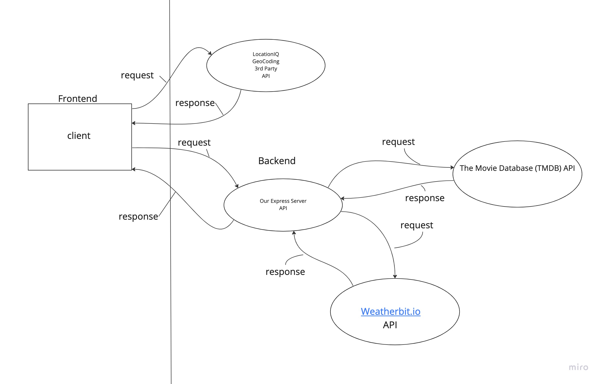

# City Explorer

**Author**: Your Name Goes Here
**Version**: 1.0.0 (increment the patch/fix version number if you make more commits past your first submission)

## Overview

This is an application that allows you to search for a city and obtain a excact location and map as well.

## Getting Started

Go to the deployed website

## Architecture

Runs through an App.js and index.js. Languages used in this application are JavaScript, CSS. Bootstrap and React libraries are used as well.

## Change Log

10-24-2022 7:35pm - Application now has a fully-functional server

Name of feature: Inital features

Start time: 0

Finish time: 4.5 hours

